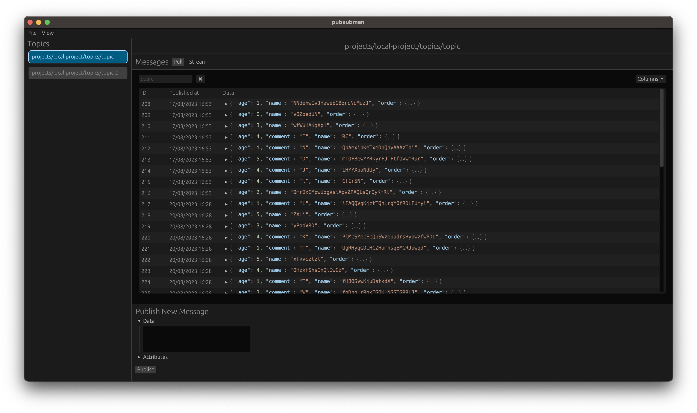

# pubsubman

[](https://github.com/dmackdev/pubsubman/actions?workflow=CI)

A GUI client for GCP Pub/Sub, built in Rust with `egui`.

<p align="center">
  
</p>

## Usage

If wishing to use a locally running GCP Pub/Sub emulator, ensure your `PUBSUB_EMULATOR_HOST` environment variable is set, e.g:

```
export PUBSUB_EMULATOR_HOST=localhost:8085
```

### From Source

```bash
cargo run --release
```

### Binary

```
cargo install --git https://github.com/dmackdev/pubsubman
pubsubman
```

### CLI Options

```console
Usage: pubsubman [OPTIONS]

Options:
      --emulator-project-id <EMULATOR_PROJECT_ID>
          Optional override for the Pub/Sub Emulator project ID
  -h, --help
          Print help
```

## Remove all `egui` app data

```bash
rm /Users/<USER>/Library/Application\ Support/pubsubman/app.ron
```
